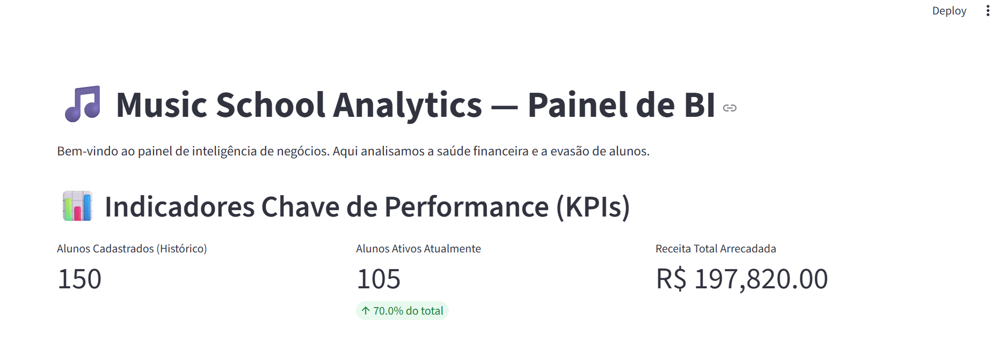
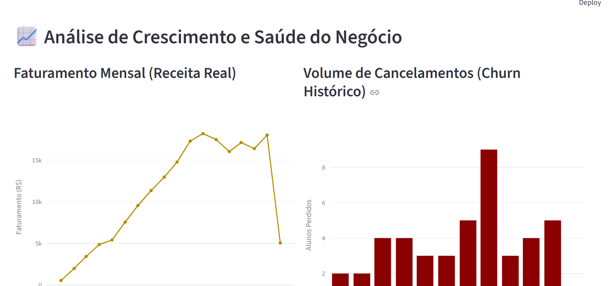
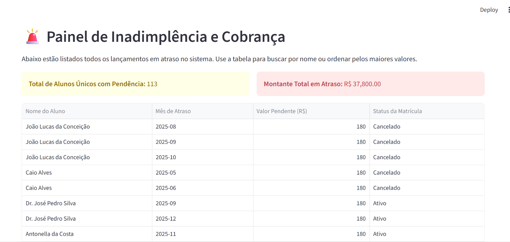

# Music School Analytics 📊

Diferente de dashboards genéricos, este projeto foi desenvolvido para resolver um problema real de gestão: a falta de visibilidade financeira e o controle de evasão (Churn) em escolas de música. 

A aplicação funciona como uma camada isolada de Business Intelligence (BI). Ela consome os dados gerados pelo sistema de produção, trata as informações em memória e entrega relatórios visuais interativos para tomada de decisão estratégica.

---

## 📸 O Painel em Ação

### Métricas de Saúde do Negócio
> Visão geral imediata do ecossistema: volume de matrículas ativas e receita total recuperada.
<p align="center">
  
</p>

### Faturamento vs. Evasão (Churn)
> Gráficos interativos para identificar sazonalidade de cancelamentos e tendências de receita mês a mês.
<p align="center">
  
</p>

### Módulo de Inadimplência e Ação de Cobrança
> Cruzamento de tabelas em tempo real para isolar quem está frequentando as aulas mas possui pendências financeiras.
<p align="center">
  
</p>

---

## 🛠️ Decisões de Arquitetura (Por que essa stack?)

* **Pandas para ETL:** Toda a inteligência do app roda aqui. Em vez de sobrecarregar o banco de dados com queries complexas cheias de subconsultas, o Python extrai os dados brutos e o Pandas faz o trabalho pesado em memória (filtros, agrupamentos por período e cálculo de Churn).
* **Streamlit como Interface:** Escolhido pela velocidade de entrega. Permitiu focar 100% na lógica de negócio e no tratamento dos dados, gerando uma interface web limpa sem a necessidade de construir um ecossistema complexo de Frontend do zero.
* **Plotly Express:** Utilizado para dar autonomia ao usuário. Os gráficos não são imagens estáticas; o gestor pode dar zoom, isolar meses específicos e auditar os pontos de dados diretamente na tela.

---

## 🧠 Desafios Técnicos Resolvidos

### 1. Modelagem do Churn Histórico
**Problema:** Descobrir quantos alunos saíram *especificamente* em cada mês para calcular a taxa de evasão.
**Solução:** Capturar a string de data de cancelamento, convertê-la para o tipo temporal do Pandas (`pd.to_datetime`) e normalizar o período para o formato Ano-Mês (`dt.to_period('M')`). Isso permitiu um agrupamento exato por competência, revelando os meses mais críticos para a retenção.

### 2. Cruzamento de Dados (Inner Join em Memória)
**Problema:** A tabela de mensalidades atrasadas só continha o ID do aluno. Para o setor de cobrança, a tabela precisa mostrar o nome do aluno e o status da matrícula.
**Solução:** Implementação do método `pd.merge()` para unificar os DataFrames de mensalidades e alunos através de chaves estrangeiras. O resultado é um relatório limpo de inadimplência gerado em milissegundos.

---

## 🚀 Como Executar o Projeto

1. Clonar o repositório:
```bash
git clone [https://github.com/TEU_USUARIO/music-school-analytics.git](https://github.com/TEU_USUARIO/music-school-analytics.git)
cd music-school-analytics